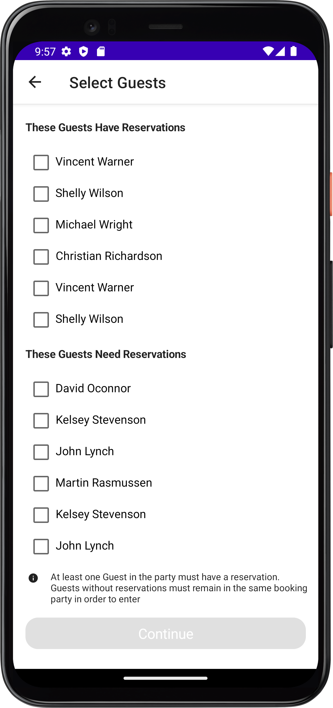
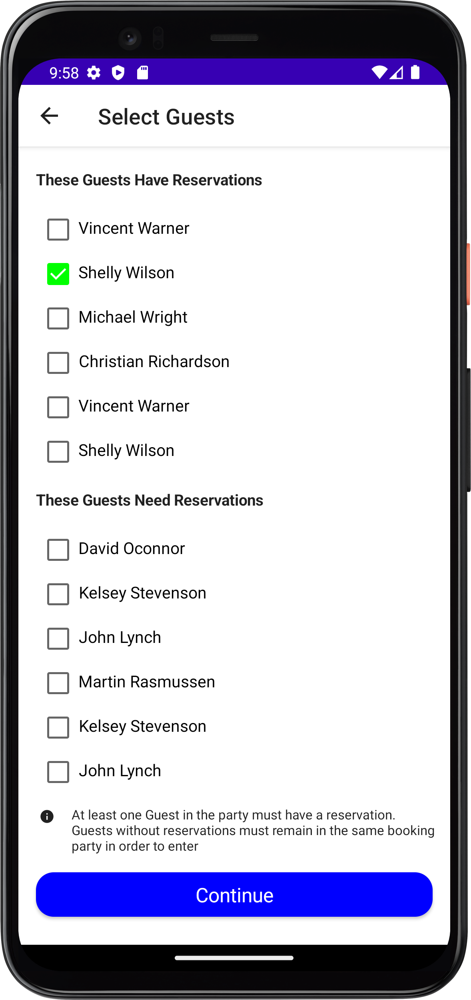
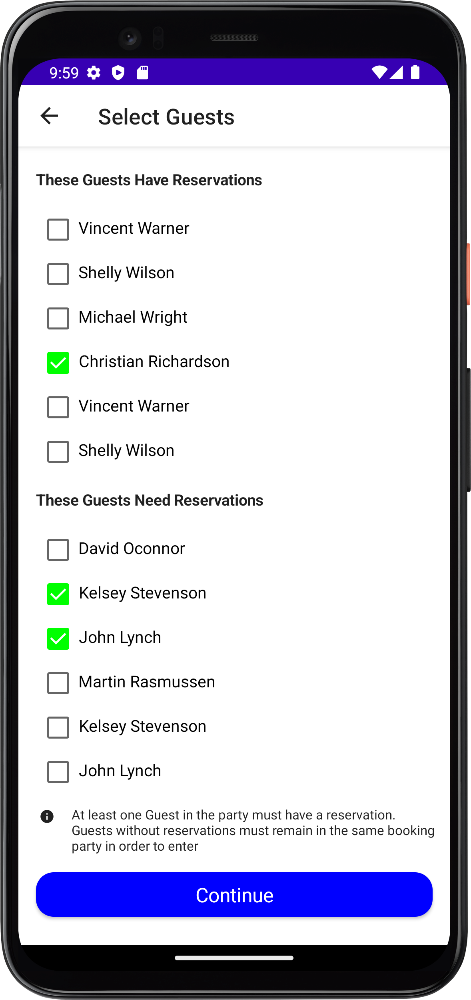

# DisneyCodeChallenge 
Simple UI to demonstrate how to apply accessibility feature to applications and control the user selection of guests based on reservation using checkbox. 
Accessibility is tested using TalkBack and Accessibility Scanner.

